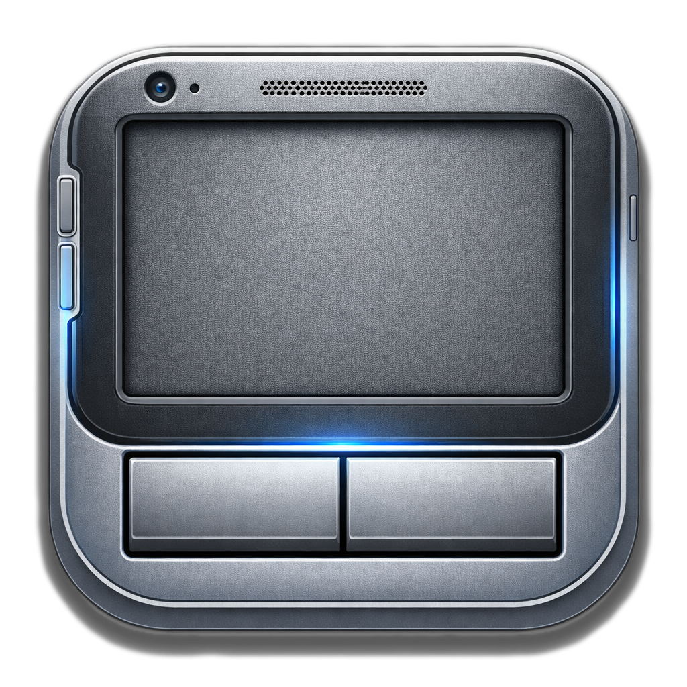

<p align="center">
  
</p>

<h1 align="center">ADB Touchpad</h1>

<p align="center">
  Turn an Android phone's screen into a touchpad for its own system cursor—without root.
</p>

<p align="center">
  <a href="README_ru.md">Русская версия</a>
</p>

> [!WARNING]
> This is an experimental, source-build-only project. It has been tested primarily on a Samsung Galaxy S23 Ultra; behavior varies across Android versions and device manufacturers.

ADB Touchpad captures full-screen gestures through an accessibility service and sends pointer input through an on-device ADB/HID backend. After installation and wireless-debugging setup, no companion computer is required for normal use in the tested configuration.

## Features

- Relative mouse movement with configurable sensitivity and acceleration
- One-finger left click and two-finger right click
- Touch-and-hold drag and optional double-tap-to-drag
- Vertical and horizontal two-finger scrolling with optional fling inertia
- One-finger edge scrolling for one-handed use
- Separate portrait and landscape cursor-center calibration
- Configurable haptics, click/drag thresholds, scrolling, and edge behavior
- Optional navigation-bar corner controls, including an auto-rotate toggle
- Settings export to an `.ini` file
- Foreground runtime service with optional boot start

## Compatibility

The current build has narrow hardware and software requirements:

- Android 13 or newer (API 33+)
- An ARM64 Android device that still supports 32-bit ARM executables
- Developer options, USB debugging, and Wireless debugging enabled
- The ADB Touchpad accessibility service enabled
- The fixed on-device Wireless ADB endpoint `127.0.0.1:5555`

The APK is packaged as `arm64-v8a`, but its bundled ADB 34.0.4 executable is a 32-bit ARM build. It will not work on 64-bit-only Android devices. The fixed loopback endpoint can also be OEM-dependent.

## Gestures

| Gesture | Action |
| --- | --- |
| Move one finger | Move the system cursor |
| Tap one finger | Left click |
| Tap two fingers | Right click |
| Move two fingers | Vertical or horizontal scroll |
| Touch and hold, then move | Drag |
| Double-tap and move | Drag when enabled in settings |
| Keep pushing after the cursor reaches an edge | One-finger edge scroll |

## Build and install

Prerequisites:

- JDK 17
- Android SDK Platform 34
- Android SDK Platform Tools, with `adb` available on `PATH`

Ensure that `ANDROID_HOME` is configured (or create a local `local.properties` containing your SDK path) and add `$ANDROID_HOME/platform-tools` to `PATH`. Then run:

```bash
./gradlew :app:assembleDebug
adb install -r app/build/outputs/apk/debug/app-debug.apk
```

Optional direct launch:

```bash
adb shell am start -n com.alex.touchpad/.ui.MainActivity
```

There is currently no production-signed APK release. The `release` build type intentionally produces an unsigned APK; signing credentials belong outside the repository.

## First-time setup

1. Open Android **Settings → Developer options**.
2. Enable **USB debugging** and **Wireless debugging**.
3. Open **Wireless debugging** and select **Pair device with pairing code**.
4. Keep the Android pairing dialog open.
5. Enter its pairing port and six-digit code in ADB Touchpad.
6. Tap **Pair Wireless Debugging**.
7. Open Accessibility settings and enable **ADB Touchpad Service**.
8. Return to the app and tap **Connect Backend + Enable Touch Capture**.
9. Grant notification permission if you want the foreground-runtime notification.

A healthy main screen reports:

- **Wireless debugging paired:** `YES`
- **Wireless ADB enabled:** `ON`
- **Shell daemon connected:** `YES`
- **Accessibility enabled:** `YES`

The app generates a unique ADB authentication key pair in its private storage on first use. If you installed a pre-public build, forget its old entry under **Wireless debugging → Paired devices** (or revoke debugging authorizations), then update and pair once again.

## Daily use and safe exit

After initial pairing, open the app and tap **Connect Backend + Enable Touch Capture**.

While capture is active, most screen touches become touchpad input. Before using the touchscreen normally, use a navigation-bar quick control or return to the app and tap **Disconnect Backend + Disable Touch Capture**. If necessary, disable ADB Touchpad from Android Accessibility settings.

Android may forget the pairing after a reboot or after Wireless debugging is toggled. If that happens, repeat the pairing flow with a fresh code.

## Quick controls and auto-rotate

The optional corner controls sit in the system navigation-bar area. The left button toggles touch capture. The right button can either mirror it or toggle Android auto-rotate.

The auto-rotate control needs Android's **Modify system settings** special access. On its first use, Android opens the relevant permission screen. When auto-rotate is disabled, ADB Touchpad preserves the device's current orientation instead of forcing portrait.

## Cursor calibration

Use **Calibrate Cursor Center Mapping** if edge-scroll centering or cursor restoration is inaccurate. Calibration moves the cursor automatically and stores separate measurements for portrait and landscape.

Do not touch the screen until the calibration countdown completes. Results remain device-dependent because the backend uses relative HID movement rather than absolute cursor positioning.

## Security and privacy

ADB Touchpad requires two powerful Android capabilities:

- Wireless debugging, used for the local ADB/HID input path
- An accessibility service that can observe windows and capture full-screen gestures

The implementation communicates with ADB over loopback and does not include analytics or a remote service. Authentication keys are generated per installation and kept in app-private storage. Build the source yourself, and disable Wireless debugging and the accessibility service when they are not needed.

## Troubleshooting

- **Pairing fails:** reopen Android's pairing dialog and immediately retry with its new port and code.
- **Backend does not connect:** confirm Wireless debugging is still enabled, then re-pair if needed.
- **Touch capture does not start:** confirm the accessibility service is enabled and that the device runs Android 13+.
- **Runtime stops in the background:** allow unrestricted battery use and grant notification permission.
- **Cursor restore or edge scroll is inaccurate:** run cursor calibration separately in portrait and landscape.
- **Installation works but the backend does not:** the device may be 64-bit-only or may not expose Wireless ADB at `127.0.0.1:5555`.

## Development

Run the local checks with:

```bash
./gradlew :app:testDebugUnitTest
./gradlew :app:lintDebug
./gradlew :app:assembleDebug :daemonspike:assembleDebug
```

Instrumented tests require a connected, paired Android device:

```bash
./gradlew :app:connectedDebugAndroidTest
```

The `daemonspike` module is a development APK used to probe the shell-daemon transport. It is not part of normal end-user setup.

Device-specific test scripts require an explicit serial:

```bash
DEVICE_SERIAL="$(adb devices | awk 'NR==2 {print $1}')" \
  ./scripts/run_device_scroll_tests.sh
```

## Third-party software

The bundled ADB executable comes from AndroidIDE's Android Platform Tools 34.0.4 ARM package. Its exact origin, checksum, and license notices are documented in [`third_party/android-platform-tools`](third_party/android-platform-tools/README.md).

Shizuku and LADB are not dependencies, but their setup guides are useful background reading for Android wireless-debugging workflows:

- [Android Debug Bridge documentation](https://developer.android.com/tools/adb)
- [Shizuku wireless debugging guide](https://shizuku.rikka.app/guide/setup/)
- [LADB](https://github.com/tytydraco/LADB)

## License

No license has been selected for the original ADB Touchpad source code. Unless a license is added later, copyright law reserves all rights. Bundled third-party components remain under their respective licenses.
